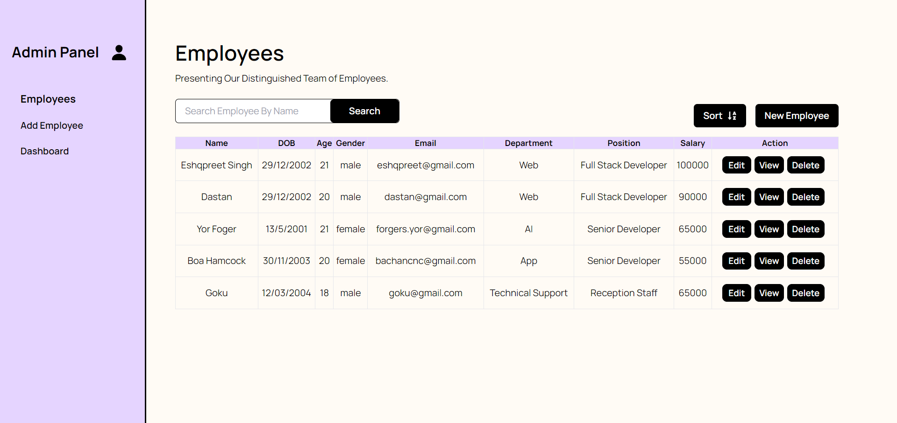
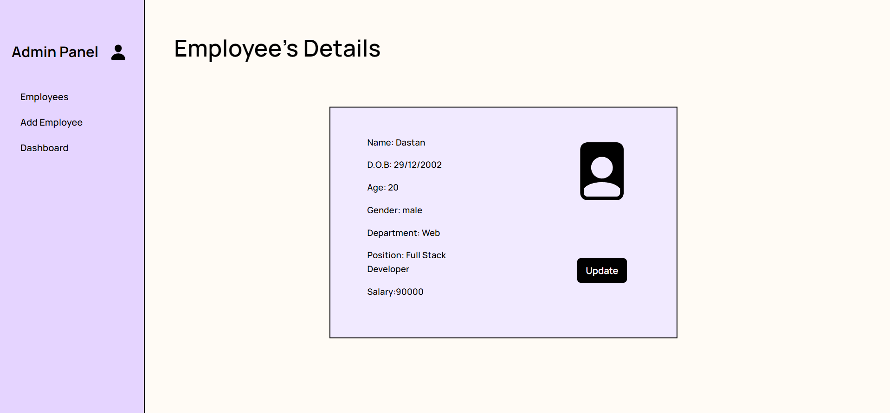
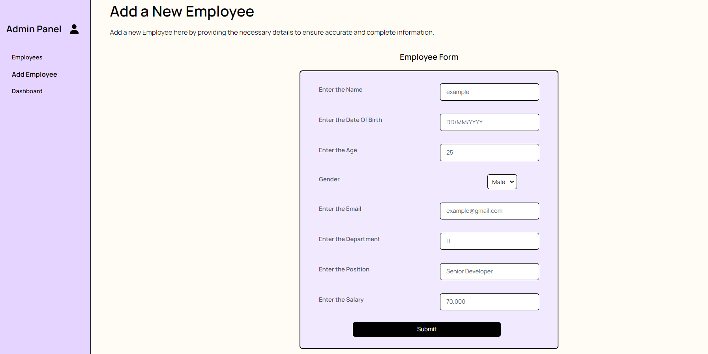
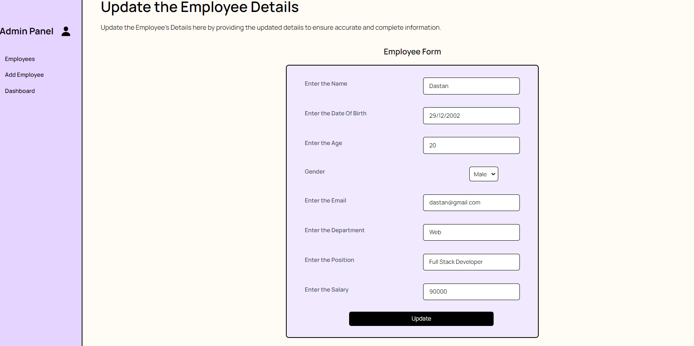
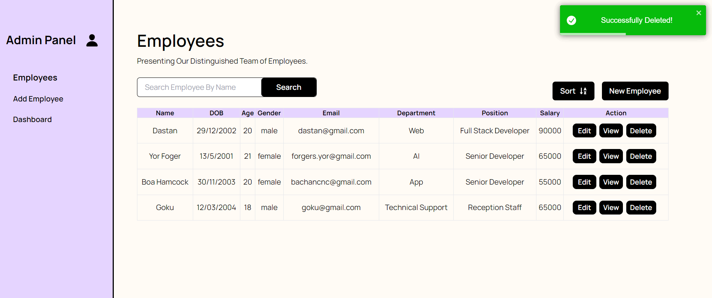

# Employee Management System

- Overview

This project is a comprehensive CRUD (Create, Read, Update, Delete) application designed to manage employee details efficiently. The application offers a user-friendly interface, making it easy to perform operations such as adding, removing, and updating employee information.

# Technologies Used

- MERN Stack:

  - MongoDB: A NoSQL database for storing employee data.
  - Express.js: A web application framework for building robust backend APIs.
  - React.js: A frontend library for creating dynamic user interfaces.
  - Node.js: A server-side runtime environment for running JavaScript on the server.
  - Chart.js: Used for data visualization on the overview dashboard.
  - React-toastify: Used for sending the required notifications.

# Features

- CRUD Operations:
  - **Landing Page**:
  One can delete , view , sort ,add etc on the landing page.
  
  - **Employee Card**:
  Here one can see the details of the employee added and can even update them.
  
  - **Add Employee**:
  Here one should fill all the details of the employee that has to be added and then one will get the notification of either successfully added or gets an error if there would be any issue.
  
  - **Update Employee**:
  Here one should update all the details of the employee that has to be update and then one will get the notification of either successfully updated or gets an error if there would be any issue.
  
  - **Delete Employee**:
  
- Data Visualization:
  - Utilizes Chart.js to provide dynamic and insightful charts on the overview dashboard.
  .PNG>)

# Setup

- Install dependencies for the frontend and backend:

  **NOTE:DO INSTALL TAILWIND FOR CSS ALONG WITH POSTCSS** 
```
 Install backend dependencies
cd server
npm install

Install frontend dependencies
cd ../client
npm install
```

- Run the application:

```
# Run backend server (from the server directory)
npm run dev

# Run frontend application (from the client directory)
npm start
```
# LICENSE
MADE BY ESHQPREET SINGH
